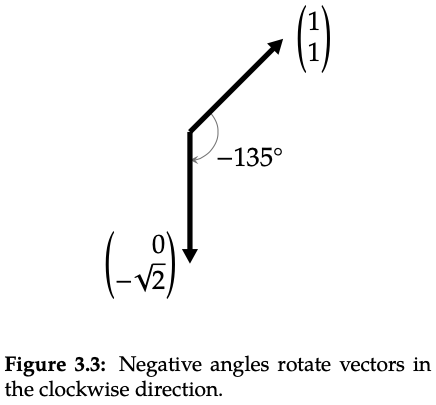
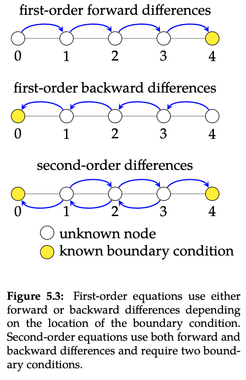

<link href="style.css" rel="stylesheet">

<h2>Errata for 
<i>Linear Algebra: Foundations of Machine Learning</i></h2>

*Last update: 2/9/2021.*

## Part 1

* **Page 24**. Figure 3.3 should be

* **Page 41**. Figure 5.3 should be

* **Page 52**. The equation

$$ c_1\mathbf{x}_1 + c_2\mathbf{x}_2 + \cdots +  c_n\mathbf{x}_n = 0 $$
should be
$$ c_1\mathbf{x}_1 + c_2\mathbf{x}_2 + \cdots +  c_n\mathbf{x}_n = \mathbf{0} $$
with the zero vector, not a scalar zero, on the righthand side.

